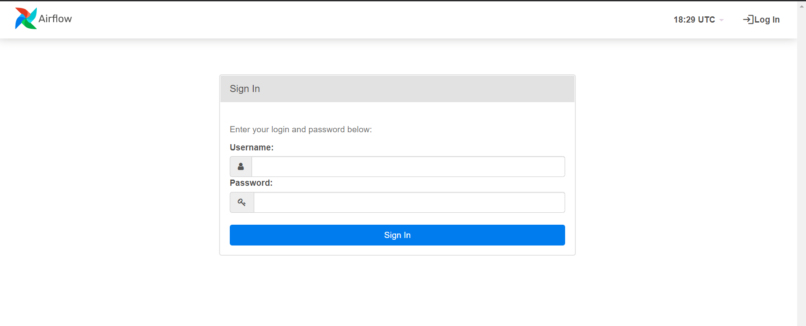
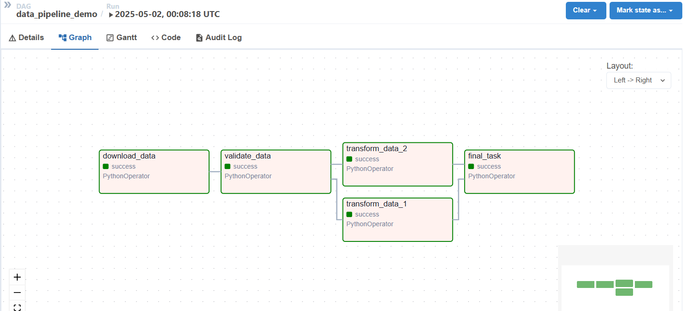
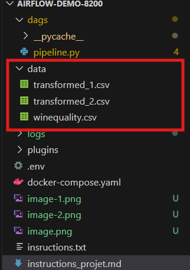
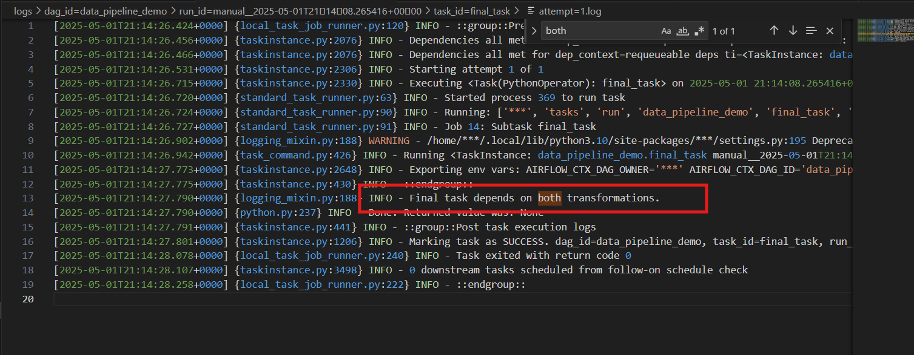
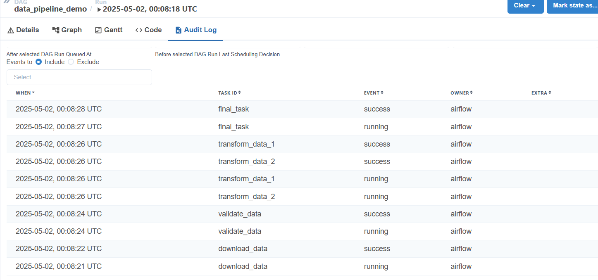

# Rapport TP2 INF 8200

## Étudiants:

 **Auguste-Marie Amoussou - AMOA77310201**
 
 **Christian Kamgne Fongang - KAMC03348606**


## I. Objectif du projet
Ce projet met en œuvre un pipeline de traitement de données simple utilisant **Apache Airflow** et **Docker Compose**, appliqué à un jeu de données qui porte sur une étude réalisée sur la qualité du vin rouge.


## II. Description des données utilisées

Pour réaliser la démo, nous avons utilisé un jeu de données qui provient de: [Wine Quality Dataset](https://archive.ics.uci.edu/ml/machine-learning-databases/wine-quality/winequality-red.csv).

Il contient des informations sur les propriétés physico-chimiques de vins rouges et blancs portugais ("Vinho Verde"), ainsi que leur note de qualité attribuée par des dégustateurs, sur une échelle de 0 à 10. Chaque ligne représente un échantillon de vin, avec des colonnes telles que l’acidité, la teneur en sucre, le pH ou le taux d’alcool.


## III. Instructions claires et expliquées

### Prérequis
- Docker Desktop (ce que nous avons utilisé)
- Docker compose
- `git` (facultatif)

Pour réaliser ce projet, avant toute chose, il vous faut démarrer **Docker Desktop**

Ensuite dans VSCode, ou dans votre éditeur de code de préférence, créer le dossier: 

### 1.  Créer le dossier et s'y déplacer 
```bash
mkdir airflow-pipeline-demo
cd airflow-pipeline-demo
```

### 2. Créer les répertoires nécessaires
```bash
mkdir -p ./dags ./logs ./plugins ./config
```

### 3. Télécharger le fichier `docker-compose.yaml` avec cette commande
```bash
curl -LfO 'https://airflow.apache.org/docs/apache-airflow/2.10.5/docker-compose.yaml'
```
Cette commande récupère le fichier `docker-compose.yaml` depuis le site de la documentation officielle de **Airflow**.

### 4. Ajouter le fichier ``pipeline.py`` dans le dossier ``dags/``
Placez votre script de DAG Airflow dans le dossier ``dags/`` du projet. Exemple : ``dags/pipeline.py``.


### 4. Créer un fichier `.env` avec le contenu suivant:
```bash
echo -e "AIRFLOW_UID=$(id -u)" > .env
```
### 5. Initialiser l'environnement Airflow
```bash
docker compose up airflow-init
```
### 6. Démarrer tous les services
```bash
docker compose up -d
```
### 7. Accéder à l'interface web de Airflow:
 * URL: `http://localhost:8080` 
 * Identifiants par défaut:
    * Username: `airflow`
    * password: `airflow`

À la première connexion, la page devrait s'afficher comme suit:
 
Vous devez entrer les identifiants par défaut. L'image insérée a été prise sur internet, car nous avons manqué de faire la capture d'écran au moment de la 1ère connexion.

## IV. Présentation de la logique du pipeline
Le pipeline est constitué de 5 tâches organisées logiquement pour simuler un flux de traitement de données complet. Voici la logique de chaque tâche :

| **Tâche** | **Description** |
|-------------|-----------------|
|``download_data`` | Télécharge le fichier CSV depuis l'URL publique et l’enregistre localement.|
|``validate_data`` | Vérifie que le fichier est lisible avec pandas.read_csv() et affiche le nombre de lignes.|
|``transform_data_1`` | Ajoute une colonne Index (identifiant) et sauvegarde le nouveau fichier.|
|``transform_data_2`` | Filtre uniquement les deux premières colonnes du jeu de données et enregistre.|
|``final_task`` | Simule une tâche finale dépendant des deux transformations précédentes.|

**Fichiers produits :**
- ``data/``
    -  ├── ``winequality.csv``
    -  ├── ``transformed_1.csv``  # Ajout d'une colonne Index
    -  ├── ``transformed_2.csv``  # Seulement les deux premières colonnes

## V. Quelques prises d'écran

### i. Graphe obtenu



### ii. Prise des fichiers créés


### iii. Aperçu de la tâche final_task avec la sortie du printf(), qu'on peut retrouver dans le repertoire ``logs``


### iv. Aperçu du log d'audit dans le GUI


## VI. Dicussion

### * Est-ce que certains aspect de Airflow n'étaient pas évident à implémenter?, pouquoi?

 - Dans notre cas, la navigation sur le GUI n'a pas été évidente du premier coup, puisqu'il s'agissait d'un nouvel interface. Mais la documentation nous a beaucoup aidé à mieux prendre en main l'outil.

- Nous avons également été confronté aux problèmes de configuration initiale (utilisateurs, variables d'environnement). Il a donc fallu avoir recours à ``Stackoverflow`` mais aussi et surtout à la documentation en ligne de **Airflow** pour bien s'approprier les étapes.

- Pour finir, les messages d’erreurs apparaissaient dans les logs de chaque tâche, ce qui nécessitait d’aller les consulter manuellement dans l’interface web. 

- Les print() dans les fonctions Python ne s’affichent pas dans le terminal mais uniquement dans les logs de la tâche.
Initialement on ne savait pas où aller les chercher, donc on a perdu du temps pour trouver.

> ###  Est-ce qu'il faudra faire attention à certains éléments dans le cas de mise à l'échelle. Par exemple, vous utiliserez peut-être une base de données ou vous sauvegaderez peut-être des fichiers et il faudrait considérer d'autres approches avant d'élaborer un pipeline de production.

Oui, c'est important de prendre certaines dispositions pour une mise à l'échelle:

  - Pour un pipeline plus lourd, passer à  KubernetesExecutor.

  - Éviter de stocker des fichiers sur le système local → préférer S3, GCS ou une base de données.

 -  Intégrer des outils comme Prometheus, Grafana pour le monitoring en production.


